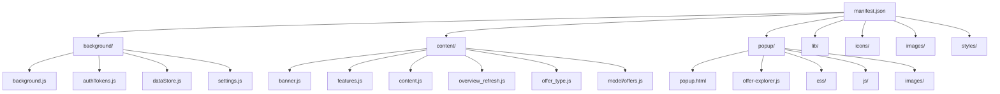

# Commercial Marketplace Extension

A browser extension that adds help services and productivity features to the Microsoft Partner Center portal for commercial marketplace partners.

---

## Project Overview

The Commercial Marketplace Extension (MAX) enhances the Microsoft Partner Center experience by providing contextual help, offer management tools, and learning resources directly within the portal. It is designed for marketplace partners to streamline their workflow and access relevant information efficiently.

---

## Project Structure

---

## Component Descriptions

- **manifest.json**: Chrome/Edge extension manifest (v3) defining permissions, scripts, and resources.
- **background/**: Contains background scripts for configuration loading, authentication, and settings management.
  - `background.js`: Handles extension lifecycle, messaging, and remote config loading.
  - `authTokens.js`, `settings.js`, `dataStore.js`: Manage authentication and persistent settings.
- **content/**: Scripts injected into the Partner Center portal to render UI enhancements and features.
  - `features.js`: Renders contextual hints and feature carousels.
  - `content.js`: Main content script, orchestrates rendering and data posting.
  - `model/offers.js`: Data model for marketplace offers.
- **popup/**: The extension's popup UI, shown when the extension icon is clicked.
  - `popup.html`: Main popup interface.
  - `offer-explorer.js`: Logic for exploring offers.
  - `css/`, `js/`, `images/`: Assets for the popup UI.
- **lib/**: Third-party libraries (e.g., jQuery, RxJS).
- **icons/**: Extension icons for various sizes.
- **images/**: Additional images and SVGs used in the UI.
- **styles/**: Global CSS styles.

---

## Loading the Extension in Microsoft Edge

1. **Build/Prepare the Extension**
   - Ensure all files are present in the project directory (no build step required for this extension).

2. **Open Edge Extension Management**
   - Navigate to `edge://extensions/` in the Edge browser.

3. **Enable Developer Mode**
   - Toggle the "Developer mode" switch in the bottom left.

4. **Load Unpacked Extension**
   - Click "Load unpacked".
   - Select the root folder of this project (where `src/manifest.json` is located).

5. **Verify Installation**
   - The extension should now appear in your Edge extensions list.
   - Pin the extension for easy access.

6. **Usage**
   - Navigate to the Microsoft Partner Center portal (`https://partner.microsoft.com/`).
   - The extension will automatically activate and enhance the portal with additional features.
   - Click the extension icon to open the popup and explore available tools.

---

## Support

This is an alpha release and is not officially supported. For issues or feedback, please open an issue in the repository.

---

## Open Source Libraries Used

This project includes the following open source libraries:

- **jQuery**  
  [https://jquery.com/](https://jquery.com/)  
  License: MIT (c) OpenJS Foundation and other contributors

- **RxJS**  
  [https://rxjs.dev/](https://rxjs.dev/)  
  License: Apache License 2.0 (c) 2015-2023 Google LLC, RxJS Contributors

- **Bootstrap**  
  [https://getbootstrap.com/](https://getbootstrap.com/)  
  License: MIT (c) The Bootstrap Authors

- **bstreeview.js**  
  [https://github.com/nhmvienna/bstreeview](https://github.com/nhmvienna/bstreeview)  
  License: MIT

---

For contribution guidelines, see [CONTRIBUTING.md](./CONTRIBUTING.md).